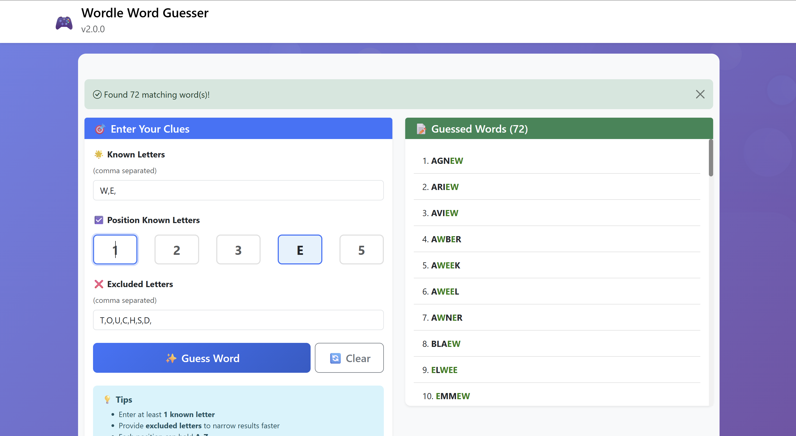

# Wordle Word Guesser - Laravel-Style MVC Architecture



A production-ready word guessing application for [Wordle](https://www.nytimes.com/games/wordle/index.html) built with a Laravel-like MVC architecture, featuring validation, controllers, models and services.

## 🎮 Features

✨ **Smart Word Matching** - Find words matching your criteria  
🎯 **Position-Based Search** - Specify known letters at their positions  
❌ **Exclude Letters** - Quickly eliminate impossible letters  
⚡ **Fast Performance** - Optimized recursive algorithm  
📱 **Responsive Design** - Mobile-friendly Bootstrap 5 interface  
🔒 **Secure** - Input sanitization and security headers  
🏗️ **MVC Architecture** - Clean, maintainable code structure  
✅ **Validation** - Form request validation  
🎮 **Controllers** - Organized request handling  
📦 **Models** - Domain models for type safety  

## 📁 Project Structure

```
wordle-word-guesser-v2/
├── app/
│   ├── Controllers/
│   │   ├── BaseController.php      # Base controller class
│   │   ├── HomeController.php      # Home page controller
│   │   └── ApiController.php       # API endpoints controller
│   ├── Models/
│   │   ├── Word.php                # Word model
│   │   └── GuessSession.php        # Session model
│   ├── Requests/
│   │   └── GuessWordRequest.php    # Form request validation
│   ├── Services/
│   │   └── WordGuesserService.php  # Business logic service
│   └── Helpers/
│       └── helpers.php             # Global helper functions
├── config/
│   ├── app.php                     # Application configuration
│   └── database.php                # Database configuration
├── resources/
│   └── views/
│       ├── home.php                # Home page view
│       └── layout.php              # Layout template
├── public/
│   ├── index.php                   # Entry point
│   └── assets/
│       ├── css/styles.css          # Stylesheets
│       └── js/app.js               # JavaScript
├── storage/
│   ├── logs/                       # Application logs
│   ├── words/                      # Word lists
│   └── database.sqlite             # SQLite database
├── .htaccess                       # Apache configuration (if used hosted with apache2)
└── README.md                       # Documentation
```

## 🚀 Installation

### Requirements

- PHP 8.0 or higher
- Apache with mod_rewrite enabled
- Word list JSON files (a.json - z.json or a.txt - z.txt)

### Setup

1. **Clone the repository**
   ```bash
   git clone https://github.com/HariK77/wordle-word-guesser-v2.git
   cd wordle-word-guesser-v2
   ```

2. **Create necessary directories**
   ```bash
   mkdir -p storage/logs
   mkdir -p storage/words
   ```

3. **Add word lists**
   Clone [dwyl/english-words](https://github.com/dwyl/english-words) repo into `storage/words/`.

   Change into 
   Run below command:
   ```bash
    php split_words.php /home/dev/projects/wwg2/storage/words/words.txt /home/dev/projects/wwg2/storage/words/json json
   ```
   or (if you want the source to use txt instead of json)
   ```bash
    php split_words.php /home/dev/projects/wwg2/storage/words/words.txt /home/dev/projects/wwg2/storage/words/txt txt
   ```
   Place JSON/TXT files in `storage/words/json` or `storage/words/txt` (a.json/a.txt through z.json/z.txt)
   
   Example format json:
   ```json
   ["about", "above", "abuse", "actor", "acute", ...]
   ```
   Example format txt:
   ```txt
   aargh
   aaron
   aavso
   ababa
   abaca
   ```

4. **Set permissions**
   ```bash
   chmod 755 storage/logs/
   chmod 755 storage/words/
   ```

5. **Configure web server**
   
   Point your web server to the `public/` directory

6. **Access the application**
   Apache2
   ```
   http://localhost/wordle-word-guesser-v2/public
   ```
   Nginx (with domain)
   ```
   http://wwg2.local
   ```

## 📚 Architecture Overview

### Models
Domain models representing core concepts:

- **Word** - Represents a word with methods for pattern matching
- **GuessSession** - Manages user session state

### Controllers
Handle HTTP requests and coordinate application logic:

- **HomeController** - Handles web UI requests
- **ApiController** - Handles JSON API requests
- **BaseController** - Provides common functionality

### Requests
Validate incoming form data:

- **GuessWordRequest** - Validates word guessing input

### Services
Encapsulate business logic:

- **WordGuesserService** - Core word guessing logic

## 💻 Usage

### Web Interface

1. Enter position known letters in their positions (1-5)
2. Enter known letters eventhough position is unknown
3. Optionally enter excluded letters (comma-separated)
4. Click "Guess Word"
5. View matching words

### API Usage

```bash
curl -X POST http://localhost/wordle-word-guesser-v2/public/api/guess \
  -H "Content-Type: application/json" \
  -d '{
    "l1": "",
    "l2": "",
    "l3": "",
    "l4": "E",
    "l5": "",
    "known": "W,E",
    "excluded": "T,O,U,C,H,S,D"
   }'
```

## 🔧 Configuration

Edit `config/app.php` to customize application settings.

## 🛡️ Security

- Input validation via `GuessWordRequest`
- Output escaping with `esc_html()` and `esc_attr()`
- Security headers (CSP, X-Frame-Options, etc.)
- SQL injection prevention (prepared for database)
- XSS protection

## 📝 Helper Functions

- `config()` - Get configuration values
- `base_url()` - Get base URL
- `view()` - Render views
- `session()` - Manage sessions
- `logger()` - Log messages
- `esc_html()` - Escape HTML
- And many more...

## 📊 Performance

- Single Unknown: ~10ms
- Two Unknowns: ~50ms
- Three Unknowns: ~200ms
- Four Unknowns: ~5s
- Five Unknowns: ~130s

## 📄 License

MIT License - feel free to use and modify!

---

**Made with ❤️ by HariK77**  
Version 2.0.0 | Laravel-Style MVC Architecture
